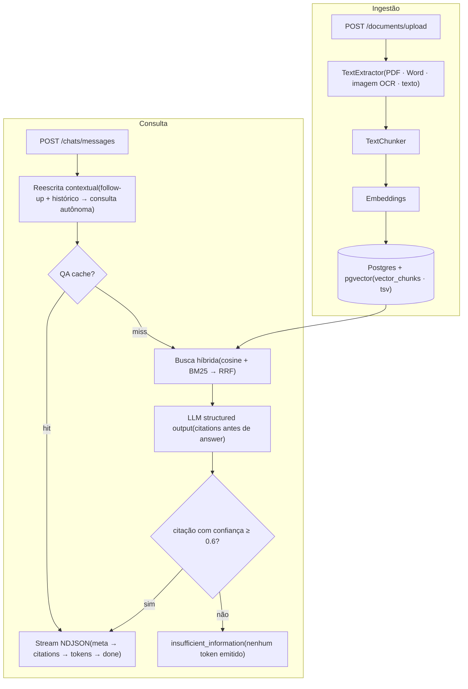

# SpotData

**API de RAG para transformar documentos em respostas confiáveis** — ingestão de PDF, Word, texto e imagem (OCR), busca híbrida (semântica + BM25), respostas em streaming com citações verificáveis e servidor MCP embutido.

[](https://github.com/FabricioRoberto079/SpotData/actions/workflows/tests.yml)
[](https://github.com/FabricioRoberto079/SpotData/actions/workflows/lint.yml)
[](https://www.python.org/)
[](https://fastapi.tiangolo.com/)
[](https://github.com/pgvector/pgvector)
[](https://github.com/astral-sh/ruff)
[](https://mypy-lang.org/)

---

## Destaques

- **Busca híbrida com RRF** — cosine distance (pgvector) + BM25 (`ts_rank_cd`, FTS em português) fundidos por Reciprocal Rank Fusion.
- **Reescrita contextual de follow-ups** — em conversas multi-turno, perguntas como "e o segundo caso?" são condensadas com o histórico numa consulta autônoma antes do embedding e da busca.
- **Anti-alucinação por design** — o LLM responde em structured output com `citations` **antes** de `answer`; se nenhuma citação atinge a confiança mínima, o stream é cortado antes de emitir qualquer token. Não existe resposta sem fonte.
- **Streaming NDJSON** — citações resolvidas chegam ao cliente antes do primeiro token da resposta.
- **Uploads robustos** — upload único, em lote e **sessões resumíveis por chunks** (pause/resume) para arquivos grandes.
- **Versionamento de documentos** — re-upload do mesmo nome gera nova versão, com download de qualquer versão anterior.
- **QA cache em duas camadas** — lookup exato por hash + lookup semântico por embedding, com invalidação por categoria.
- **Multi-provider** — OpenAI, Google ou Anthropic via LangChain; trocar de provider é editar 2 linhas de `.env`.
- **Servidor MCP embutido** — qualquer cliente MCP (Claude Desktop etc.) consulta a base via `/mcp`.

## Sumário

- [Arquitetura](#arquitetura)
- [Stack](#stack)
- [Começando](#começando)
- [API](#api)
- [Servidor MCP](#servidor-mcp)
- [Variáveis de ambiente](#variáveis-de-ambiente)
- [Desenvolvimento](#desenvolvimento)
- [Roadmap](#roadmap)

## Arquitetura



**Ingestão:** `upload → TextExtractor → TextChunker → embeddings → vector_chunks (pgvector)`. Os chunks da versão atual ficam marcados `is_latest=true`, com coluna `tsv` populada para BM25. O Postgres guarda metadata e os bytes do arquivo (`document_versions.file_data`).

**Consulta** (`POST /chats/messages`):

1. **Reescrita contextual** — em chats com histórico, uma chamada barata de LLM (structured output `CondensedQuery`) condensa histórico + pergunta numa consulta autônoma; follow-ups como "e o segundo caso?" chegam à busca com sinal semântico real. Qualquer falha cai na pergunta crua.
2. **QA cache** — lookup exato por hash da consulta normalizada; se miss, embedding + lookup semântico em `qa_cache_entries`. Hit serve a resposta sem chamar o LLM.
3. **Busca híbrida** (`RAG_TOP_K=10` chunks) — cosine via pgvector + BM25 via `ts_rank_cd`, fundidos por RRF (`HYBRID_CANDIDATE_K=60` de cada lado, `RRF_K=60`).
4. **LLM** — structured output `RagAnswer` devolve `{citations: [{context_index, confidence}], answer}`. O schema declara `citations` antes de `answer`, então o decoding constrained emite as citações primeiro.
5. **Stream NDJSON** — `meta` → `citations` (assim que o LLM fecha o array) → `token` (deltas reais) → `done`.
6. **Gates de grounding** — sem chunk recuperado, ou sem citação com `confidence ≥ MIN_CITATION_CONFIDENCE` (0.6), a resposta é `insufficient_information` e nenhum token é emitido.
7. **Write-through** — respostas `success` alimentam o QA cache.

O histórico das últimas 10 mensagens entra como contexto (turnos sem resposta válida são pulados).

## Stack

| Camada | Tecnologia |
|---|---|
| API | FastAPI + Uvicorn |
| Banco | PostgreSQL + pgvector (vetores e BM25 no mesmo banco) |
| ORM / Migrations | SQLAlchemy 2 + Alembic |
| LLM | LangChain (OpenAI / Google / Anthropic) com structured output |
| Extração | pypdf, python-docx, antiword, Tesseract OCR |
| Qualidade | ruff (lint + format) · mypy · pytest · pip-audit |
| Infra | Docker multi-stage (non-root, healthcheck) + docker compose |

## Começando

> Todas as variáveis do `.env.example` são **obrigatórias** — o app falha no boot se faltar qualquer uma. A referência completa está em [Variáveis de ambiente](#variáveis-de-ambiente).

### Via Docker (recomendado)

```bash
cp .env.example .env
# preencha: JWT_SECRET (openssl rand -hex 32), modelos LLM e a API key do provider escolhido
docker compose up --build
```

As migrations Alembic rodam automaticamente no startup. Acesse:

- API — `http://localhost:8080`
- Swagger — `http://localhost:8080/docs`

Para parar: `docker compose down` (mantém dados) ou `docker compose down -v` (apaga o volume do Postgres).

### Local (API no host, Postgres em container)

```bash
docker compose up -d postgres

python -m venv .venv && source .venv/bin/activate
pip install -r requirements.txt -r requirements-dev.txt

# dependências de sistema dos extractors:
#   Fedora:        sudo dnf install tesseract antiword
#   Debian/Ubuntu: sudo apt install tesseract-ocr antiword

cp .env.example .env   # POSTGRES_HOST=localhost neste modo
alembic upgrade head
python main.py         # http://localhost:8080 com auto-reload
```

## API

JWT obrigatório em todos os endpoints, exceto `POST /auth/register`, `POST /auth/login`, `POST /auth/forgot-password`, `POST /auth/reset-password`, `GET /health` e `/docs`.

| Grupo | Rotas |
|---|---|
| Auth | `POST /auth/register` · `POST /auth/login` · `POST /auth/forgot-password` · `POST /auth/reset-password` · `GET /auth/me` |
| Admin (papel `admin`) | `GET POST /admin/categories` · `PATCH DELETE /admin/categories/{id}` · `GET /admin/users` · `PATCH /admin/users/{id}/role` · `PATCH /admin/users/{id}/active` |
| Categorias | `GET /categories` |
| Documentos | `GET /documents` · `POST /documents/upload` · `POST /documents/upload/batch` · `GET /documents/search` · `GET DELETE /documents/{id}` · `GET /documents/{id}/download` · `GET /documents/{id}/versions/{n}/download` |
| Sessões de upload | `POST /documents/upload-sessions` · `GET /documents/upload-sessions/{id}` · `PUT /documents/upload-sessions/{id}/chunk` · `POST /documents/upload-sessions/{id}/pause` · `POST /documents/upload-sessions/{id}/complete` · `DELETE /documents/upload-sessions/{id}` |
| Pastas de chat | `GET POST /chat-folders` · `PUT DELETE /chat-folders/{id}` |
| Chats | `GET /chats` · `GET PATCH DELETE /chats/{chat_id}` · `POST /chats/messages` |

Notas de design:

- **Upload** (`kind` = `file` \| `image` \| `text`): `category_id` é opcional — sem ele o documento fica compartilhado entre todas as categorias. Re-upload do mesmo `file_name` cria nova versão automaticamente. Exige papel `editor` ou `admin`.
- **Upload em lote** (`/upload/batch`): vários arquivos numa chamada; cada item reporta sucesso ou erro individualmente.
- **Sessões resumíveis**: para arquivos grandes — crie a sessão, envie chunks (`PUT .../chunk`), pause e retome quando quiser, finalize com `complete`.
- **Não existe `POST /chats`** — o chat nasce na primeira mensagem; `PATCH /chats/{id}` renomeia ou move de pasta.

### Papéis e categorias

Três papéis (`users.role`): **admin** (gerencia categorias e usuários), **editor** (ingere e consulta) e **viewer** (só consulta). Novos registros nascem `viewer`.

Categorias escopam a **recuperação**, não o acesso: todo usuário autenticado enxerga todas as categorias. O chat escolhe a categoria na criação (campo `category_id` da primeira mensagem) e o RAG daquele chat fica restrito a ela — mais os documentos sem categoria. Nomes são normalizados na criação (`"  Recursos   Humanos! "` → `RECURSOS_HUMANOS`).

> **Bootstrap do admin** — depois da primeira migração, promova um usuário manualmente:
>
> ```sql
> UPDATE users SET role = 'admin' WHERE email = 'voce@exemplo.com';
> ```

### Contrato de streaming (`POST /chats/messages`)

`Content-Type: text/event-stream`; cada linha do corpo é um objeto JSON completo (NDJSON — sem o framing `data:`/`event:` do SSE).

| `type` | Quando | Payload |
|---|---|---|
| `meta` | sempre, primeiro evento | `chat_id`, `query_id`, `response_id` |
| `citations` | uma vez, **antes** dos tokens | array resolvido: `document_id`, `version_number`, `file_name`, `page`, `excerpt`, `confidence_score`, `download_url` |
| `token` | deltas token a token do `answer` | `content` |
| `done` | sempre, último evento | `status` (`success` \| `insufficient_information` \| `error`), `time_ms` |
| `error` | só em falha de LLM | `kind`, `message` |

<details>
<summary>Exemplo — resposta fundamentada</summary>

```
{"type":"meta","chat_id":"...","query_id":"...","response_id":"..."}
{"type":"citations","citations":[{"document_id":"...","page":4,"excerpt":"...","confidence_score":0.93,"file_name":"x.pdf","download_url":"/documents/.../download"}]}
{"type":"token","content":"A "}
{"type":"token","content":"meta "}
{"type":"token","content":"de "}
{"type":"token","content":"2026..."}
{"type":"done","status":"success","time_ms":1840}
```

</details>

<details>
<summary>Exemplo — pergunta fora da base</summary>

```
{"type":"meta",...}
{"type":"citations","citations":[]}
{"type":"done","status":"insufficient_information","time_ms":210}
```

Nenhum `token` é emitido; o frontend renderiza o estado vazio a partir do `status` do `done`.

</details>

## Servidor MCP

A busca RAG é exposta via [Model Context Protocol](https://modelcontextprotocol.io/) no endpoint streamable HTTP `/mcp`, montado no mesmo processo da API (código em `src/mcp/`).

| Tool | Args | Retorno |
|---|---|---|
| `ask_question` | `question`, `chat_id?` | `chat_id`, `query_id`, `response_id`, `question`, `status`, `answer`, `citations`, `time_ms` |

Cada chamada exige `Authorization: Bearer <JWT>` — o mesmo `access_token` de `POST /auth/login`; o `user_id` sai do `sub` do token, sem fallback de env var. Aponte qualquer cliente MCP para `http://<host>:8080/mcp` com esse header.

## Variáveis de ambiente

| Variável | Exemplo | Descrição |
|---|---|---|
| `POSTGRES_USER` / `_PASSWORD` / `_DB` / `_HOST` / `_PORT` | `spotdata` / … / `localhost` / `5432` | Postgres com pgvector — a migração inicial executa `CREATE EXTENSION vector`. |
| `LLM_CHAT_MODEL` / `LLM_EMBEDDING_MODEL` | `openai:gpt-4o-mini` / `openai:text-embedding-3-large` | Formato `<provider>:<model>`. Trocar o embedding model exige re-indexar o corpus. |
| `LLM_STRUCTURED_MODEL` | `openai:gpt-4o-mini` | Opcional — usa o chat model se vazio. |
| `EMBEDDING_DIMENSION` | `3072` (3-large) / `1536` (3-small, ada-002) / `768` (google text-embedding-004) | Dimensão dos vetores em `vector_chunks` e `qa_cache_entries`; deve casar com o embedding model. |
| `OPENAI_API_KEY` / `GOOGLE_API_KEY` / `ANTHROPIC_API_KEY` | — | Preencha a do provider escolhido. |
| `JWT_SECRET` | `openssl rand -hex 32` | Assinatura dos tokens. |
| `JWT_ALGORITHM` / `JWT_EXPIRATION_MINUTES` | `HS256` / `60` | Config JWT. |
| `SMTP_HOST` / `_PORT` / `_USER` / `_PASSWORD` / `_FROM` | `smtp.x.com` / `587` / … | E-mails de reset de senha; porta 465 = SSL implícito, demais = STARTTLS. |
| `CORS_ORIGINS` | `https://app.x.com,https://y.com` | Lista separada por vírgula; nunca use `*` com credenciais em produção. |
| `LOG_LEVEL` | `INFO` | Logger raiz. |

## Desenvolvimento

### Qualidade e testes

```bash
ruff check . && ruff format --check .   # lint + formatação
mypy                                    # type-check (src + main.py)
pytest                                  # suíte completa (SQLite em memória)
```

### Migrations

```bash
alembic revision --autogenerate -m "descrição"
alembic upgrade head
alembic downgrade -1
```

### CI

Dois workflows rodam em todo push/PR para `main`, no mesmo Python do deploy (3.13):

- **`lint.yml`** — ruff + mypy
- **`tests.yml`** — testes unitários com cobertura (`pytest`)

## Roadmap

Próximos passos imediatos:

- Object storage (S3/MinIO) — hoje os arquivos vivem como `LargeBinary` no Postgres
- Rate limiting no endpoint de LLM
- Autorização granular (ACL por documento/pasta/chat)

Melhorias maiores de arquitetura (verificação de grounding independente, DB assíncrono, vetorização em background, cache compartilhado, índice ANN, CD) estão detalhadas em [`ROADMAP.md`](ROADMAP.md).
